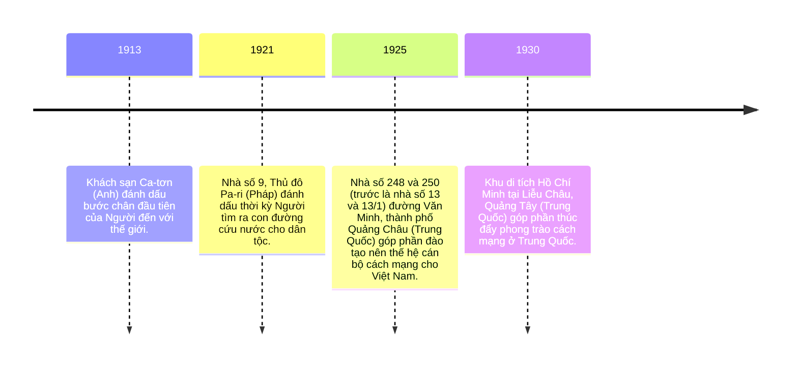

<div class="absolute top-10">
  <span class="font-700">
    Tổ 4 lớp 12/5
  </span>
</div>

<div class="absolute bottom-10">
  <h1>CHỦ TỊCH HỒ CHÍ MÌNH</h1>
  <p>Trong lòng người dân</p>
</div>

---
transition: slide-left
layout: image-left
image: https://external-content.duckduckgo.com/iu/?u=https%3A%2F%2Fwww.thefamouspeople.com%2Fprofiles%2Fimages%2Fho-chi-minh-15.jpg&f=1&nofb=1&ipt=66290e0c445085dfadf585219188669754c5c67f248ef09985103f72a421a959
hideInToc: true
---

# Mục lục

- <Link to="3" title="Hồ Chí Minh trong lòng nhân dân thế giới"/>
- Hồ Chí Minh trong lòng nhân dân Việt Nam

---
layout: section
background: https://image.nhandan.vn/w790/Uploaded/2025/cqjlcqdqj/2022_09_13/152-6082.jpg.webp
---

# Hồ Chí Minh trong lòng nhân dân thế giới

Tổ chức Giáo dục, Khoa học và Văn hoá của Liên hợp quốc (UNESCO) trong khoá họp lần thứ 24 tại Pa-ri (1987) đã thông qua Nghị quyết số 24C/18.65 về Kỉ niệm ngày sinh của Chủ tịch Hồ Chí Minh. Năm 1990 sẽ đánh dấu 100 năm Ngày sinh của Chủ tịch Hồ Chí Minh, Anh hùng giải phóng dân tộc và Nhà văn hóa kiệt xuất của Việt Nam.

---
section: statement
---

# Toàn văn bản dịch Nghị quyết 18.65 về kỷ niệm 100 năm ngày sinh của chủ tịch Hồ Chí Minh.
Đại hội đồng,

<v-switch>

<template #1> <AutoFitText modelValue="Nhận thấy việc tổ chức kỷ niệm ngày sinh các nhân vật trí thức lỗi lạc và các danh nhân văn hóa trên phạm vi quốc tế góp phần thực hiện các mục tiêu của UNESCO và đóng góp vào sự hiểu biết trên thế giới,"/>
</template>

<template #2> <AutoFitText modelValue="Nhận thấy việc tổ chức kỷ niệm ngày sinh các nhân vật trí thức lỗi lạc và các danh nhân văn hóa trên phạm vi quốc tế góp phần thực hiện các mục tiêu của UNESCO và đóng góp vào sự hiểu biết trên thế giới,"/>
</template>

<template #3> <AutoFitText modelValue="Ghi nhận năm 1990 sẽ đánh dấu 100 năm kỷ niệm ngày sinh của Chủ tịch Hồ Chí Minh, Anh hùng giải phóng dân tộc và Nhà văn hóa kiệt xuất của Việt Nam,"/>
</template>

<template #4>
<AutoFitText modelValue="Nhận thấy Chủ tịch Hồ Chí Minh, một biểu tượng xuất sắc về sự tự khẳng định dân tộc, đã cống hiến trọn đời mình cho sự nghiệp giải phóng dân tộc của nhân dân Việt Nam, góp phần vào cuộc đấu tranh chung của các dân tộc vì hòa bình, độc lập dân tộc, dân chủ và tiến bộ xã hội,"/>
</template>

<template #5>
<AutoFitText modelValue="
Nhận thấy những đóng góp quan trọng và nhiều mặt của Chủ tịch Hồ Chí Minh trên các lĩnh vực văn hóa, giáo dục và nghệ thuật chính là sự kết tinh của truyền thống văn hóa hàng ngàn năm của dân tộc Việt Nam, và những tư tưởng của Người là hiện thân của những khát vọng của các dân tộc mong muốn được khẳng định bản sắc văn hóa của mình và mong muốn tăng cường sự hiểu biết lẫn nhau giữa các dân tộc,"/>
</template>

<template #6> <AutoFitText modelValue="
1. Khuyến nghị các quốc gia thành viên cùng tham gia kỷ niệm 100 năm ngày sinh của Chủ tịch Hồ Chí Minh, bằng việc tổ chức các hoạt động cụ thể để tưởng niệm Người, qua đó làm cho mọi người hiểu rõ tầm vóc vĩ đại của những tư tưởng và những cống hiến cho sự nghiệp giải phóng dân tộc của Người;"/>
</template>
<template #7> <AutoFitText modelValue="
2. Đề nghị Tổng giám đốc UNESCO triển khai các biện pháp thích hợp để kỷ niệm 100 năm Ngày sinh của Chủ tịch Hồ Chí Minh và hỗ trợ các hoạt động kỷ niệm được tổ chức nhân dịp này, đặc biệt là những hoạt động sẽ diễn ra ở Việt Nam."/>
</template>
</v-switch>

---
layout: statement
---

### Tại một số quốc gia, nơi Chủ tịch Hồ Chí Minh từng đến và hoạt động đều có những công trình di tích tưởng niệm, thể hiện lòng biết ơn và sự kính trọng của người dân sở tại đối với Người.



---
layout: section
---

# Hồ Chí Minh trong lòng nhân dân Việt Nam

---
layout: iframe
url: https://vanphuc.hochiminh.vn/
---

---
layout: statement
---

# Cuộc đời Hồ Chí Minh là một tấm gương sáng chói, những phẩm chất cách mạng và nhân đạo cao cả nhất

Sống mãi trong lòng người dân

---
layout: 3-images
imageLeft: https://external-content.duckduckgo.com/iu/?u=https%3A%2F%2F3.bp.blogspot.com%2F-KcCqkuffLbg%2FXBEWluHsThI%2FAAAAAAAAAAc%2FxeJvOFV0XJwSl90KHtqa1qxlA0_xYsauwCEwYBhgL%2Fs1600%2Fquang-truong-tuong-dai-ho-chi-minh.jpg&f=1&nofb=1&ipt=7c3dbbf3d7cc2b06019c5efc248e69a53908b9a51524ebf2b56cbd8589dd89af
imageTopRight: https://external-content.duckduckgo.com/iu/?u=https%3A%2F%2Fik.imagekit.io%2Ftvlk%2Fblog%2F2023%2F02%2Flang-chu-tich%25E2%2580%2593ho-chi-minh-2.png%3Ftr%3Ddpr-2%2Cw-675&f=1&nofb=1&ipt=fcbf323be0e434d9d85c31011a693a7dc097a8797e00116f2184595dac9ce909
imageBottomRight: https://external-content.duckduckgo.com/iu/?u=https%3A%2F%2Fhalotravel.vn%2Fwp-content%2Fuploads%2F2020%2F08%2Fnha-san-bac-ho-6.jpg&f=1&nofb=1&ipt=fa9993e3983122cdfa22b3bfc51041b25dfea851cc4932b8b90f124092ccc0fe
---

---
layout: section
transition: fade
---

<div v-motion
  :initial="{ x: -80 }"
  :enter="{ x: 0, y: 0 }"
  :click-1="{ x: 0, y: 45 }"
  :click-2="{ x: 80, y: 45 }"
  :click-2-4="{ x: 395, y: 0 }"
>
Xin cảm ơn
</div>

<v-switch>
  <template #1> Fuck you Trúc Linh </template>
  <template #2> Về lại bụng mẹ thêm 9 tháng nữa rồi ra</template>
  <template #3> </template>
</v-switch>

---
layout: center
---

# XIN CẢM ƠN

---

<Poll question="What is your favorite color ?" :answers="['Red', 'Green', 'Blue']" correctAnswer="0" />

```

```
