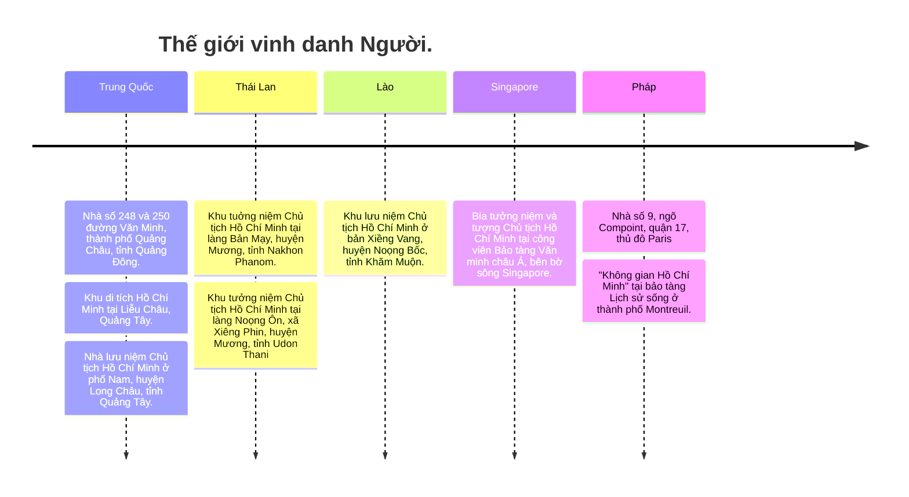

  
    Tổ 4 lớp 12/5
  

  <h1>CHỦ TỊCH HỒ CHÍ MÌNH</h1>
  
Trong lòng người dân

---
layout: image-left
image: https://external-content.duckduckgo.com/iu/?u=https%3A%2F%2Fwww.thefamouspeople.com%2Fprofiles%2Fimages%2Fho-chi-minh-15.jpg&f=1&nofb=1&ipt=66290e0c445085dfadf585219188669754c5c67f248ef09985103f72a421a959
hideInToc: true
---

# Mục lục

- <Link to="3" title="Hồ Chí Minh trong lòng nhân dân thế giới"/>
- <Link to="15" title="Hồ Chí Minh trong lòng nhân dân Việt Nam"/>

---
layout: image-right
image: "https://truyenhinhnghean.vn/file/4028eaa46735a26101673a4df345003c/4028eaa467f477c80167f4aa053f0c68/092022/2022-09-02_072114_20220902072210.jpg"
---

# Hồ Chí Minh trong lòng nhân dân thế giới

Tổ chức Giáo dục, Khoa học và Văn hoá của Liên hợp quốc (UNESCO) trong khoá họp lần thứ 24 tại Pa-ri (1987) đã thông qua Nghị quyết số 24C/18.65 về Kỉ niệm ngày sinh của Chủ tịch Hồ Chí Minh. Năm 1990 sẽ đánh dấu 100 năm Ngày sinh của Chủ tịch Hồ Chí Minh, Anh hùng giải phóng dân tộc và Nhà văn hóa kiệt xuất của Việt Nam.

---
section: statement
---

# Toàn văn bản dịch Nghị quyết 18.65 về kỷ niệm 100 năm ngày sinh của chủ tịch Hồ Chí Minh.

Đại hội đồng,

<v-switch>

<template #1> <AutoFitText modelValue="Nhận thấy việc tổ chức kỷ niệm ngày sinh các nhân vật trí thức lỗi lạc và các danh nhân văn hóa trên phạm vi quốc tế góp phần thực hiện các mục tiêu của UNESCO và đóng góp vào sự hiểu biết trên thế giới,"/>
</template>

<template #2> <AutoFitText modelValue="Ghi nhận năm 1990 sẽ đánh dấu 100 năm kỷ niệm ngày sinh của Chủ tịch Hồ Chí Minh, Anh hùng giải phóng dân tộc và Nhà văn hóa kiệt xuất của Việt Nam,"/>
</template>

<template #3>
<AutoFitText modelValue="Nhận thấy Chủ tịch Hồ Chí Minh, một biểu tượng xuất sắc về sự tự khẳng định dân tộc, đã cống hiến trọn đời mình cho sự nghiệp giải phóng dân tộc của nhân dân Việt Nam, góp phần vào cuộc đấu tranh chung của các dân tộc vì hòa bình, độc lập dân tộc, dân chủ và tiến bộ xã hội,"/>
</template>

<template #4>
<AutoFitText modelValue="
Nhận thấy những đóng góp quan trọng và nhiều mặt của Chủ tịch Hồ Chí Minh trên các lĩnh vực văn hóa, giáo dục và nghệ thuật chính là sự kết tinh của truyền thống văn hóa hàng ngàn năm của dân tộc Việt Nam, và những tư tưởng của Người là hiện thân của những khát vọng của các dân tộc mong muốn được khẳng định bản sắc văn hóa của mình và mong muốn tăng cường sự hiểu biết lẫn nhau giữa các dân tộc,"/>
</template>

<template #5> <AutoFitText modelValue="
1. Khuyến nghị các quốc gia thành viên cùng tham gia kỷ niệm 100 năm ngày sinh của Chủ tịch Hồ Chí Minh, bằng việc tổ chức các hoạt động cụ thể để tưởng niệm Người, qua đó làm cho mọi người hiểu rõ tầm vóc vĩ đại của những tư tưởng và những cống hiến cho sự nghiệp giải phóng dân tộc của Người;"/>
   </template>

   <template #6> <AutoFitText modelValue="
2. Đề nghị Tổng giám đốc UNESCO triển khai các biện pháp thích hợp để kỷ niệm 100 năm Ngày sinh của Chủ tịch Hồ Chí Minh và hỗ trợ các hoạt động kỷ niệm được tổ chức nhân dịp này, đặc biệt là những hoạt động sẽ diễn ra ở Việt Nam."/>
   </template>
   </v-switch>

---
layout: two-cols
transition: fade
---

<AutoFitText modelValue="
Đây là minh chứng cho sự
ngưỡng mộ và tôn vinh của
nhân dân thế giới đối với vị
lãnh tụ vĩ đại của dân tộc
Việt Nam." />

::right::

<AutoFitText modelValue="
Ngoài ra, nhiều nhân vật quốc tế cũng đã có nhiều ấn tượng tốt về cụ." />

---
layout: quote
transition: fade
---

# "Nếu ai muốn tìm một từ có thể tóm gọn tất cả cuộc đời của Chủ tịch Hồ Chí Minh thì đó là một sự hết sức giản dị và hết sức khiêm tốn của Ông"

Cựu tổng thống Chile Xanvado Agiende

---
layout: quote
transition: fade
---

# "Niềm hy vọng cũng có nhiều tên gọi khác nhau, song ở Việt Nam niềm hy vọng được tượng trưng là Chủ tịch Hồ Chí Minh…"

Nhà văn nữ Blaga Đimitrova của Bulgaria

---
layout: quote
transition: fade
---

# "Đây là một con người vĩ đại nhưng không bao giờ tỏ ra mình là một con người vĩ đại. Mặc dầu có những trọng trách phải gánh vác, Người vẫn thân ái, nhiệt tình và sôi nổi làm cho bạn cảm thấy thoải mái"

Tổng Bí thư Đảng Cộng sản Anh Giôn Gô-lan

---
layout: quote
transition: fade
---

# “Một người bảo vệ kiên quyết nhất sự đoàn kết của các lực lượng tiến bộ và cách mạng trên thế giới”

Cựu tổng thống Cuba Fidel Castro

---
layout: fact
transition: slide-up
---

# Rất nhiều nơi trên thế giới đã dựng tượng đài Chủ tịch Hồ Chí Minh

Theo thống kê, đến nay tượng và tượng đài tưởng niệm Hồ Chủ tịch đã có mặt tại khoảng 20 nước trên thế giới.

---
layout: intro-image
image: https://file.qdnd.vn/data/images/0/2021/05/30/lamanh/kienthuc-kolkata_ezlg.jpg?dpi=150&quality=100&w=575
transition: slide-up
---

  <h1>Ấn Độ</h1>
  
Tượng đài Chủ tịch Hồ Chí Minh tại thành phố Kolkata.

---
layout: intro-image
image: https://file.qdnd.vn/data/images/0/2021/05/30/lamanh/kienthuc-havana_cfbi.jpg?dpi=150&quality=100&w=575
transition: slide-up
---

  <h1>Cuba</h1>
  
Tượng đài Chủ tịch Hồ Chí Minh bằng đồng tại Công viên Hòa Bình cạnh Đại lộ 26.

---
layout: intro-image
image: https://file.qdnd.vn/data/images/0/2021/05/30/lamanh/kienthuc-mexico-city_jbvi.jpg?dpi=150&quality=100&w=575
transition: slide-up
---

  <h1>Mexico</h1>
  
Trong công viên “Tự do cho các dân tộc”, thủ đô Mexico.

---
layout: full
---

---
layout: image-left
image: "https://i.pinimg.com/236x/da/da/54/dada54cb8320d8ac377480ead06bcd2a.jpg"
---

# Hồ Chí Minh trong lòng nhân dân Việt Nam

Bác Hồ, vị lãnh tụ muôn vàn kính yêu của dân tộc Việt Nam. Người đã lãnh đạo dân tộc Việt Nam giành được độc lập, đánh đuổi những đế quốc sừng sỏ nhất, đem lại cuộc sống ấm no hạnh phúc cho muôn dân. Mỗi người Việt Nam đều yêu quý, kính trọng và đời đời nhớ ơn Bác. Bác đã trở thành bất tử, sống mãi trong lòng người dân Việt Nam.

---
layout: section
---

# Công trình tưởng niệm

---
layout: 3-images
imageLeft: https://external-content.duckduckgo.com/iu/?u=https%3A%2F%2F3.bp.blogspot.com%2F-KcCqkuffLbg%2FXBEWluHsThI%2FAAAAAAAAAAc%2FxeJvOFV0XJwSl90KHtqa1qxlA0_xYsauwCEwYBhgL%2Fs1600%2Fquang-truong-tuong-dai-ho-chi-minh.jpg&f=1&nofb=1&ipt=7c3dbbf3d7cc2b06019c5efc248e69a53908b9a51524ebf2b56cbd8589dd89af
imageTopRight: https://external-content.duckduckgo.com/iu/?u=https%3A%2F%2Fik.imagekit.io%2Ftvlk%2Fblog%2F2023%2F02%2Flang-chu-tich%25E2%2580%2593ho-chi-minh-2.png%3Ftr%3Ddpr-2%2Cw-675&f=1&nofb=1&ipt=fcbf323be0e434d9d85c31011a693a7dc097a8797e00116f2184595dac9ce909
imageBottomRight: https://external-content.duckduckgo.com/iu/?u=https%3A%2F%2Fhalotravel.vn%2Fwp-content%2Fuploads%2F2020%2F08%2Fnha-san-bac-ho-6.jpg&f=1&nofb=1&ipt=fa9993e3983122cdfa22b3bfc51041b25dfea851cc4932b8b90f124092ccc0fe
---

---
layout: two-cols
---

# Ý nghĩa

<AutoFitText modelValue="
Những công trình tưởng niệm không chỉ thể hiện tình cảm thiêng liêng mà còn là niềm tự hào, là động lực tinh thần to lớn khích lệ nhân dân tích cực thực hiện lời dạy của Người là xây dựng một nước Việt Nam hòa bình, độc lập, thống nhất, dân chủ và giàu mạnh."/>

::right::

<AutoFitText modelValue="
Theo thống kê của Bảo tàng Hồ Chí Minh, hiện nay cả nước có khoảng 400 công trình tưởng niệm về Người. Các công trình nhà máy, đài kỷ niệm, biêu lưu niệm, trường  học,  xí nghiệp, đường phố, công viên... mang tên Chủ tịch Hồ Chí Minh v.v..."/>

---

# Văn học nghệ thuật
<v-switch>
<template #1>

<AutoFitText modelValue="
Trong các loại hình văn học, Chủ tịch Hồ Chí Minh trở thành nguồn cảm hứng đề giới văn nghệ sĩ sáng tác, tiêu biểu như các tác phẩm: Sáng tháng Năm, Bác ơi (Tố Hữu); Người đi tìm hình của nước (Chế Lan Viên); Búp sen xanh và Cuộc chia li trên Bến Nhà Rồng (Sơn Tùng); Trông vời cố quốc (Hoàng Quảng Uyên)"/>

</template>
<template #2>

<AutoFitText modelValue="
Trong lĩnh vực nghệ thuật, Chủ tịch Hồ Chí Minh là chủ đề lớn cho nhiều nhạc sĩ sáng tác, các nhà biên kịch xây dựng kịch bản và các nghệ sĩ biểu diễn phục vụ công chúng, đặc biệt vào dịp kỉ niệm những ngày lễ lớn, tiêu biểu như các bộ phim: Hẹn gặp lại Sài Gòn (Sơn Tùng viết, Long Văn đạo diễn); Nguyễn Ái Quốc ở Hồng Kông (kịch bản của Hữu Mai, Nguyễn Khắc Lợi đạo diễn)..."/>

</template>
</v-switch>

---
transition: fade
---

# Tư tưởng

<v-switch>
<template #1>
<AutoFitText modelValue="
Nhằm phát huy giá trị to lớn của tư tưởng, đạo đức Hồ Chí Minh, tháng 11-2006 Bộ Chính trị Ban Chấp hành Trung ương Đảng Cộng sản Việt Nam đã ban hành Chỉ thị số 06/CT TW, phát động cuộc vận động “Học tập và làm theo tấm gương đạo đức Hồ Chí Minh”."/>
</template>

<template #2>
<AutoFitText modelValue="Cuộc vận động đã lan tỏa và mang lại hiệu quả tích cực trên nhiều lĩnh vực của đời sống chính trị - xã hội. Năm 2016, Bộ Chính trị Ban Chấp hành Trung ương Đảng Cộng sản Việt Nam ban hành Chỉ thị 05-CT/TW “Về đẩy mạnh học tập và làm theo tư tưởng, đạo đức phong cách Hồ Chí Minh”. Việc học tập và làm theo tư tưởng, đạo đức, phong cách Hồ Chí Minh được xác định gắn với quá trình xây dựng và phát triển văn hóa con người Việt Nam trong thời kì đẩy mạnh công nghiệp hoá, hiện đại hoá và hội nhập quốc tế."/>
</template>
</v-switch>

---
layout: center
---

# XIN CẢM ƠN

Vì nhóm 4 không nhất trí về làm Slide nên thành ra có hai cái khác nhau, vận dụng công nghệ và triết lý thiết kế khác nhau. Slide này quan tâm đến sử dụng công nghệ tiên tiến nhất và phù hợp nhất cho trình bày rõ ràng trên màn hình lớn. Slide kia thì...tùy.

Phần công công việc:
- Slide: Đàm Anh Tuấn
- Nội dung: Đàm Anh Tuấn (và vô số nguồn bị ăn cắp khác)

Slide tiếp theo là thử nghiệm tham quan Khu di tích Kim Liên quê Bác thầy có thể xem hoặc không. 

---
layout: iframe
url: https://sanpham.starglobal3d.com/smart-heritage-3d/kdt-kim-lien/?startscene=scene_flycam-view_(1)&startactions=lookat(27.64,27.87,114.39,0,0);

---
